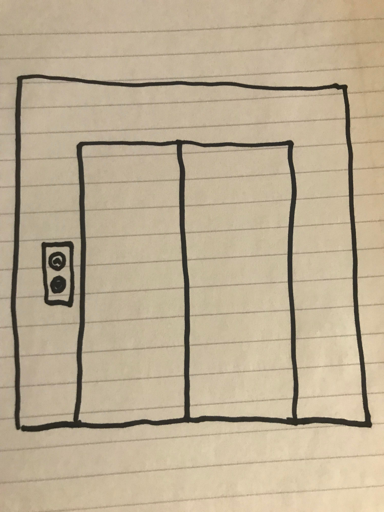

[Tutorial Home](README.md)

# Stacks
## Last in, First Out

A stack is a data structure consisting of a list of elements. Stacks are characterized by the fact that the most recent element in the stack will be removed first.

## Structure

A Stack is like an elevator. As you go up, you add data into the stack. You can only access a particular piece of data (go to a different floor) by traversing all floors on the way there (which in a stack, removes them).



## Methods

| Name | Description |
| - | - |
| Push(el) | Adds an element to the top of the stack |
| Pop()  | Removes the top element in the stack and returns its value |
| Peek() | Get the value from the top element in the stack |
| Empty()  | Check to see if the stack is empty |

## Efficiency of Common Operations

| Operation | Time Complexity |
| - | - |
| Push | O (1) |
| Pop  | O (1) |
| Peek | O (1) |
| Empty  | O (1) |

## Where would you use it

Stacks are useful when the most recent piece of data is the one we care about. They can be incredibly useful in things such as:

* Software Stacks
* Undoing something (Ctrl-Z is a great example!)

## Example

```C#
Stack<string> pancakes = new Stack<string>();

pancakes.Push("Buttermilk");
pancakes.Push("Banana Chocolate Chip");
// ["Buttermilk", "Banana Chocolate Chip"]

string removedPancake = pancakes.Pop();
// "Banana Chocolate Chip"

string topPancake = pancakes.Peek();
// "Buttermilk"

bool outOfPancakes = pancakes.Empty();
// false

pancakes.Push("Blueberry");
pancakes.Push("Strawberry");
pancakes.Push("Chocolate Chip");
pancakes.Push("Peach");
pancakes.Push("Peanut Butter");
// ["Buttermilk", "Blueberry", "Strawberry", "Chocolate Chip", "Peach", "Peanut Butter"]
```

## Problem to Solve

You have been asked to implement an undo operation in a command line based version of tower of hanoi. Most of the game has already been built, however, right now the undo functionality is not yet working. Your task is to implement the push, pop, and peek functionality in the stack class (as well as a push list, just for usability). 

[The Problem](stack/problem) - [Example Solution](stack/example-solution)

---

[Back to Home](README.md) - [Next Lesson: Queues](2-queue.md)