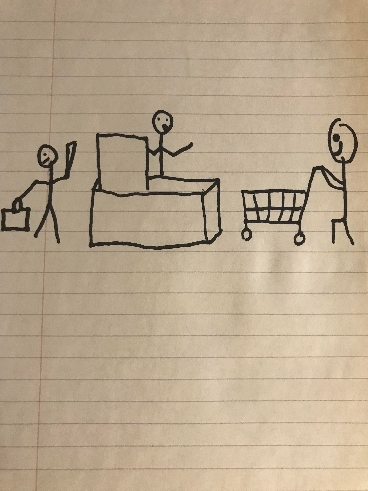

[Tutorial Home](README.md)

# Queues
## First in, First Out

A queue is a data structure consisting of a list of elements. Queues are characterized by the fact that the oldest element in the queue will be removed first.

## Structure

A Stack is like a line at the grocery store. A customer entering the line is like data entering the queue. When a customer reaches the front of the line, they are served, and then they leave, which is akin to the dequeue operation, which removes the element at the front of the queue and returns its value. Nothing special happens to items in the middle of the queue, they just wait their turn.



There are also more specialized types of queue, such as the circular queue or the priority queue.
### Circular Queue

In a circular queue, the last element is connected to the first element. When we would normally exceed our specified queue size, we can wrap around and utilize any space which has been freed during our previous dequeueing.

### Priority Queue

In a priority queue, we care about the priority of the elements rather than the time they were inserted. In a priority queue, each item is given a priority when it is added to the queue, and then when a dequeue operation is used, it removes the highest priority item instead of the oldest one.

---

## Methods

| Name | Description |
| - | - |
| Enqueue(el) | Adds an element to the back of the queue |
| Dequeue()  | Removes the element from the front of the queue and returns its value |
| Peek() | Get the value from the element at the front of the queue |
| Size() | Get the size of the queue |
| Empty() | Check whether the queue is empty |
| Rotate(N)  | Shift N elements from the front of the queue to the back |

## Efficiency of Common Operations

| Operation | Time Complexity |
| - | - |
| Enqueue | O (1) |
| Dequeue  | O (1) |
| Peek | O (1) |
| Size | O (1) |
| Empty  | O (1) |
| Rotate  | O (N) |

## Where would you use it

Queues are useful when the earliest piece of data is the one we care about. They can be incredibly useful in things such as:

* Customer Help Requests in a Helpdesk Application
* Networking Calls on a Machine

## Example

```C#
Queue<string> customers = new Queue<string>();

customers.Enqueue("Mariah");
customers.Enqueue("Sarah");
customers.Enqueue("Dante");
// ["Mariah", "Sarah", "Dante"]

string customerToHelp = customers.Dequeue();
// "Mariah"

string nextCustomer = customers.Peek();
// "Sarah"

customers.Rotate(1);
customers.Enqueue("Bob");
// ["Dante", "Sarah", "Bob"]
```

## Problem to Solve

Your challenge is to implement the queue data structure in a program which allows us to draw cards from a deck, and guess whether the next card will be higher or lower. Most of the structure for the program is implemented, but you will need to implement the enqueue, dequeue, and peek functionality.

[The Problem](queue/problem) - [Example Solution](queue/example-solution)

---

[Previous Lesson: Stacks](1-stack.md) - [Next Lesson: Sets](3-set.md)