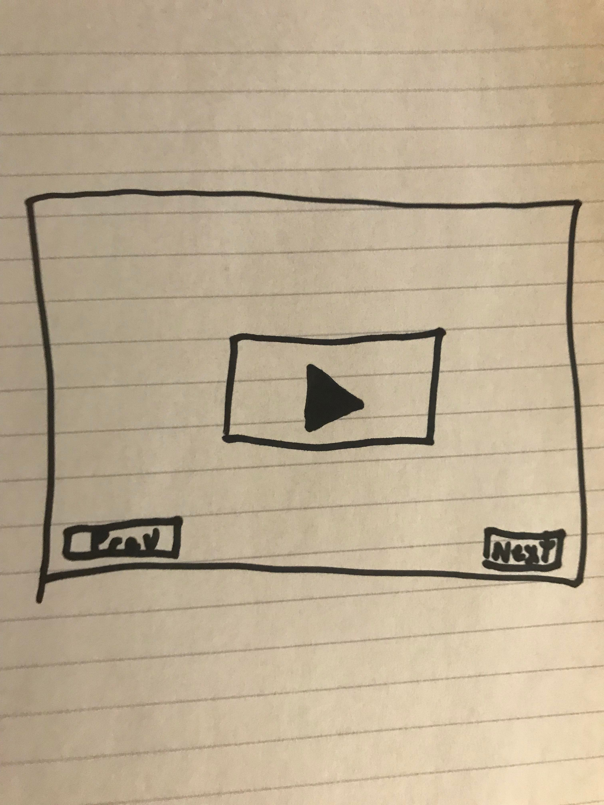

[Tutorial Home](README.md)

# Linked Lists
## Next please!

A linked list is a data structure wherein each node will reference the next node in a lis (and sometimes the previous ones), allowing the user to quickly access elements adjactent to the node.

## Structure

First, it is essential to know that a linked list is comprised of many nodes. The linked list will reference the head, and tail nodes, but will not contain a list of all nodes in the list. 

Streaming television shows can be fairly similar to this. At the end of each episode, you are always prompted to watch the next one. Choosing to watch another episode is akin to calling next on the node of a linked list. 



There are some more specialized types of linked lists, such as doubly-linked lists, or circular linked lists.

### Doubly-Linked Lists

Doubly-linked lists nodes reference the previous element in addition to the next element.

### Circular linked lists

The last element in a circular linked list will reference the first element, and vice verse. This is particularly useful for implementing buffers.

---

## Methods

| Name | Description |
| - | - |
| InsertHead(el) | Inserts an element into the head of the linked list |
| InsertTail(el) | Inserts an element into the tail of the linked list |
| Remove(el)  | Removes an element from the linked list |
| Search(el) | Find and return element from within linked list |
| Size() | Get the size of the linked list |
| Empty() | Check whether the linked list is empty |

## Efficiency of Common Operations

| Operation | Time Complexity |
| - | - |
| InsertHead | O(1) |
| InsertTail | O(1) |
| Remove  | O(N) |
| Search | O(N) |
| Size | O(1) |
| Empty | O(1) |

## Where would you use it

Linked-lists are useful when we processing order is very important and needs to be consistent. They can be useful in some interesting cases such as:

* Controlling the flow of asynchronous functions (think .next)
* Navigating to the previous or next page in a web browser

## Example

```C#
LinkedList<string> movieSeries = new LinkedList<string>();

movieSeries.InsertTail("Harry Potter and the Sorcerer's Stone");
movieSeries.InsertTail("Harry Potter and the Chamber of Secrets");
movieSeries.InsertTail("Harry Potter and the Prisoner of Azkaban");
movieSeries.InsertTail("Harry Potter and the Goblet of Fire");
movieSeries.InsertTail("Harry Potter and the Order of the Phoenix");
movieSeries.InsertTail("Harry Potter and the Half-Blood Prince");
movieSeries.InsertTail("Harry Potter and the Deathly Hallows");

Node firstMovie = movieSeries.head;
string firstMovieTitle = firstMovie.GetValue();
// "Harry Potter and the Sorcerer's Stone"

Node secondMovie = firstMovie.next;
string secondMovieTitle = secondMovie.GetValue();
// "Harry Potter and the Chamber of Secrets"

Node lastMovie = movieSeries.tail;
string lastMovieTitle = lastMovie.GetValue();
// "Harry Potter and the Deathly Hallows"

bool cursedChildIsCanon = movieSeries.Search("Harry Potter and the Cursed Child");
// false
```

## Problem to Solve

Your challenge is to implement the linked list data structure in a program which lets us play the classic message passing game, telephone, with a buddy! Most of the structure for the program is implemented, but you will need to implement the InsertHead, InsertTail, Remove, and Search functionality.

[The Problem](linked-list/problem) - [Example Solution](linked-list/example-solution)

---

[Previous Lesson: Sets](3-set.md) - [Next Lesson: Graphs](5-graph.md)