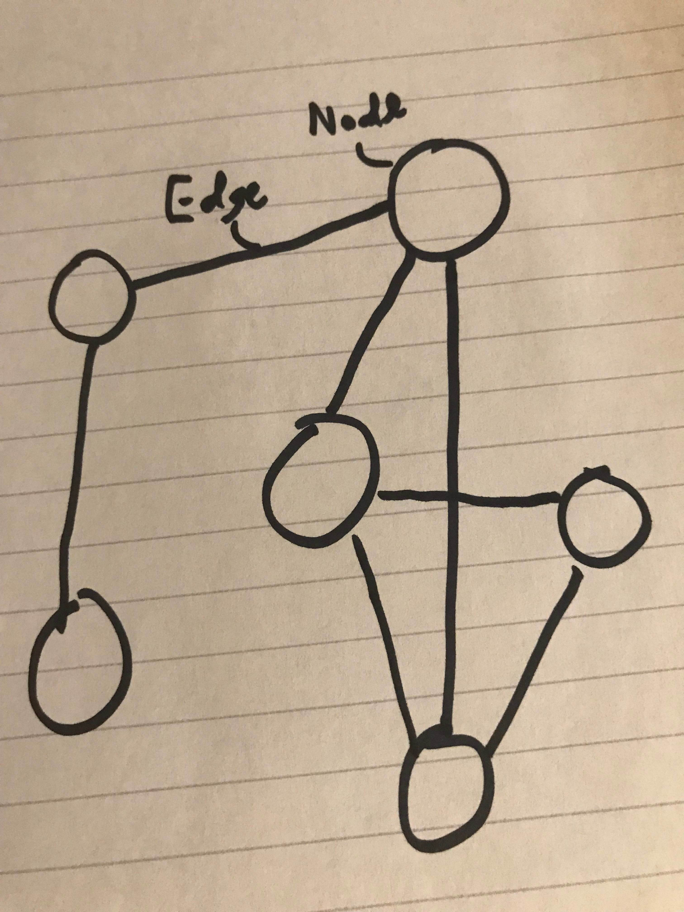

[Tutorial Home](README.md)

# Graph
## Interconnected Nodes

A graph is a data structure which consists of nodes and edges. They can be useful when how data is connected is as important as the data itself!

## Structure

Nodes in a graph are classes which cointain a value for the node, and a list for the connected nodes (unless you are using an adjacency matrix). Edges simply represent the connections between the nodes, and will either be stored in a list for each node, or will be stored in a matrix of bits which simply store a 1 if there is an edge, or a 0 if there is no edge.



There are some more specialized types of graphs, such as...

Directed graphs: which also stores the direction can flow along edges. 

Adjacency matrix graphs: which are used more when each node will be connected to almost every other.

---

## Methods

| Name | Description |
| - | - |
| Initialize(N) | Initialize the memory for the graph for N nodes |
| Insert(El) | Insert a new element into the graph |
| Remove(El) | Remove an element from the graph |
| Connect(NodeA, NodeB) | Connect two nodes |
| Disconnect(NodeA, NodeB) | Disconnect two nodes |
| Traverse(Pred) | Traverse the graph and execute the predicate on every node |

## Efficiency of Common Operations

| Operation | Time Complexity |
| - | - |
| Initialize | O(N^2) |
| Insert | O(1) |
| Remove | O(1) |
| Connect | O(1) |
| Disconnect | O(1) |
| Traverse | O(N) |

## Where would you use it

Graphs are good for when the connections between data are as important or more important than the literal data. They can be useful in some interesting cases such as:

* Building a Tree Data Structure, trees are just graphs with restrictive rules on what can connect to what
* Social Networks
* Neural Networks and Machine Learning

## Example

```C#
Graph<string> users = new Graph<string>();

users.Insert("Bob");
users.Insert("Cathy");
users.Insert("Lauren");
// {
// "Bob": Node,
// "Cathy": Node,
// "Lauren": Node,
// }

users.Connect("Bob", "Cathy");
users.Connect("Cathy", "Lauren");

users["Bob"].GetConnectedNodes();
// ["Cathy"]

users.Connect("Bob", "Lauren");
users["Bob"].GetConnectedNodes();
// ["Cathy", "Lauren"]

users.Remove("Cathy");
users["Bob"].GetConnectedNodes();
// ["Lauren"]

users.Disconnect("Bob", "Lauren");
users.Search("Bob").GetConnectedNodes();
// []

Graph<string> remainingUsers = users;
// {
// "Bob": Node,
// "Lauren": Node,
// }
```

## Problem to Solve

Your challenge is to implement the insert, remove, connect, disconnect, and traverse methods in order to get the graph in the problem working. When it is working, you should have a functional command line social media simulator (obviously, its hard to have a social network when it isn't actually online).

[The Problem](graph/problem) - [Example Solution](graph/example-solution)

---

[Previous Lesson: Linked Lists](4-linked-list.md) - [Next Lesson: Trees](6-tree.md)