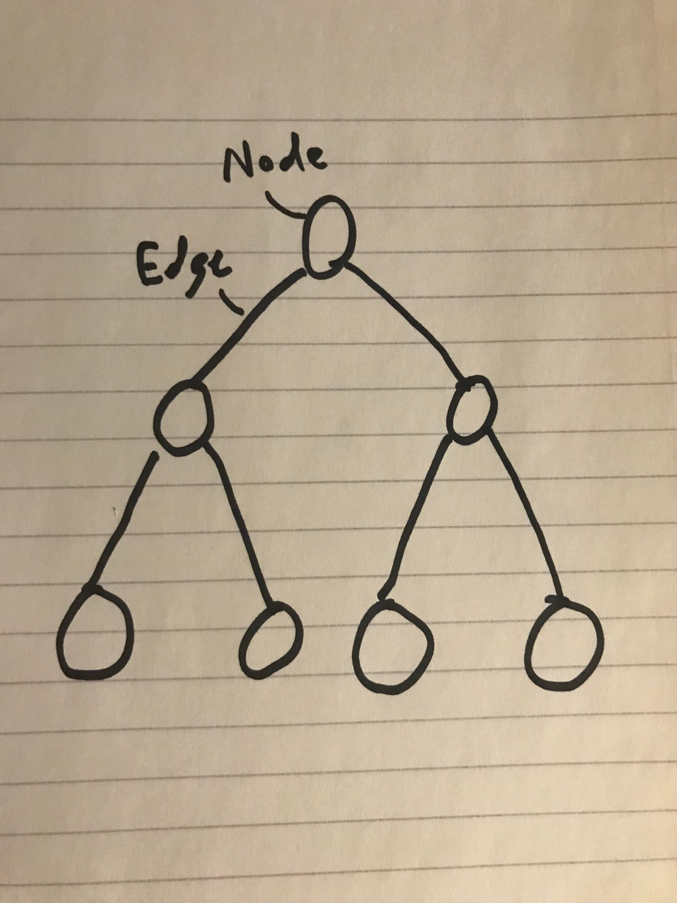

[Tutorial Home](README.md)

# Trees (More Specifically, Binary Search Trees)
## Left Node? Right Node?

A binary search tree is a data structure which consists of nodes, each of which contain up to two child nodes, for as many values as we need to store. When we insert a node, it is automatically sorted into the binary search tree, which makes searching for values later much faster.

## Structure

Trees consist of a root node, which contains a value, and a reference to its children. Each node in a binary search tree will automatically be sorted, and will reference up to two children. The height of a tree references the maximum number of connections from a parent node to one of its children. Lastly, the idea of balancing a binary search tree is an operation we do where when a tree is very lopsided we choose a point in the tree, and rotate its nodes so that they have as short a height as possible.



## Methods

| Name | Description |
| - | - |
| Insert(El) | Inserts an element into the tree |
| Delete(El) | Deletes an element from the tree |
| Search(El) | Searches for an element within the tree |
| Traverse(Pred) | Traverses the tree and executes predicate on each node |

## Efficiency of Common Operations

| Operation | Time Complexity |
| - | - |
| Insert | O(log N) |
| Delete | O(log N) |
| Search | O(log N) |
| Traverse | O(N) |

## Where would you use it

Trees are useful because they automatically sort the items within them, and make it incredibly easy to search for items within a tree, as they are already sorted. They can be useful in some interesting cases such as:

* Indexing
* Sorting Algorithms

## Example

```C#
BinarySearchTree<int> nums = new BinarySearchTree<int>();

nums.Insert(3);
nums.Insert(2);
nums.Insert(1);
//   3
//  2
// 1

nums.Remove(2);
nums.Search(4);
// false

nums.Insert(6);
//   3
//  1 6

nums.Traverse((int num) => {
    Console.WriteLine(num);
});
// 1 3 6
```

## Problem to Solve

Your challenge is to implement the Insert, Search, and Traverse functionality into a Binary Search Tree, which is used to sort numbers! 
You can (optionally) write a method within the BST class to convert it to a Balanced Binary Search Tree. Even if you don't, check out that code in the example solution.

[The Problem](tree/problem) - [Example Solution](tree/example-solution)

---

[Previous Lesson: Graphs](5-graph.md)